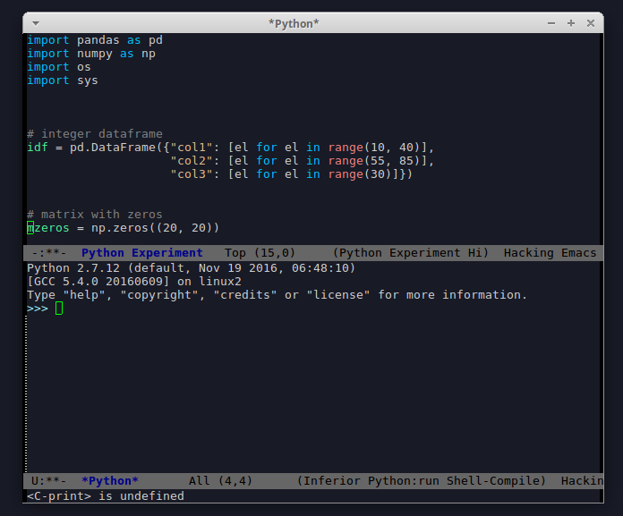

# python-experiment-mode

**Package to make Experiments in Python way lot easier.**


*How many times you desired to have a dummy dictionary or dataframe just available to verify if that obscure operation you developed works or not?*

*Well, these issues are addressed by this package.*


# Installation
For now, there is only one way to install this package. 

First clone the repo in the right folder:

``` shell
cd ~/.emacs.d/site-packages
git submodule add https://github.com/wandersoncferreira/python-experiment-mode
```

Then add these lines to your **init.el** file.


``` emacs-lisp
(add-to-list 'load-path "~/.emacs.d/site-packages/python-experiment-mode")
(require 'python-experiment-mode)
```

If you desire to see this package in MELPA let me know in Issues.


# Usage

There are 4 recommended bindings in this package:

``` emacs-lisp
(global-set-key (kbd "<f9>") 'python-experiment)
(global-set-key (kbd "<f10>") 'python-experiment-lived-too-long)
(global-set-key (kbd "<f11>") 'python-experiment-reload)
(global-set-key (kbd "<f12>") 'python-experiment-buffer-to-file)
```


<kbd>F9</kbd> will open a frame like this one below:




The Python Experiment Buffer is not attached to any file and you can easily edit it.


<kbd>F10</kbd> will shut everything down!


<kbd>F11</kbd> If you edit the Python Experiment Buffer to include any additional datatype, you can press **F11** to reload the Inferior Python Process with the new additions.


<kbd>F12</kbd> After a whole day of work you might have added several custom additions to your specific situation. Press **F12** to save the Python Experiment Buffer to a custom file that will be loaded in the next time.


# Settings

There are a few builtin modules loaded by default: os and sys.
However you can customize this variable using the **list-of-builtins** variable as follows:


```eshell
(setq list-of-builtins '((functools . nil) (os . nil) (collections . cl)))
```

This variable holds an alist which first member is the name of your module and the second member is its alias.

The collection module would be imported as:

``` python
import collections as cl
```


OBS: Every default data or module is only loaded if you have the module installed in your Python Environment. The package already checks it.


# Contributions

I would love to extend this package. Open a Issue and let me know of your ideas!
Not need to any programming skiils: Problems still to be addressed: Naming conventions!!


If you want to contribute adding more standard datatypes at the "data" folder, submit a Pull Request right away. o/


# Possible future features

I have been looking through the [Factory Boy](https://factoryboy.readthedocs.io/en/latest/) library. Might be using this to make the package more robust and scalable. Would be possible to make fake copies of your custom entities from your own projects easily. The possibilities are endless. 


However, adds a dependancy to this library's usage. (partially!)
